# 数据可视化大作业

赛题 II：科学可视化挑战赛  
题目：基于体绘制与相空间刷选的 Nyx 宇宙密度演化可视分析  
学院：  
姓名：  
学号：  
班级：  
完成日期：  

## 摘要

针对数据读取与验证问题，Nyx 宇宙学模拟密度数据以连续 `.dat` 二进制文件存储，文件本身不包含可直接浏览的图像结构，也不包含显式表头信息。若直接将其当作普通图片或表格处理，将无法获得正确的空间含义。因此，本实验首先从数据格式出发，使用 little-endian float32 方式读取原始文件，并依据文件大小和体素总数自动推断 n×n×n 立方体网格尺寸。在恢复体数据时，实验特别处理了原始 z 轴最快、y 轴其次、x 轴最慢的线性存储顺序，通过 reshape 和 permute 将数据转换为更适合 MATLAB 和 Web 展示的 x-y-z 三维密度体。为了验证读取过程是否可靠，实验对首个时间步提取 XY、XZ、YZ 三个中心切片，并检查所有时间步文件大小是否一致，同时统计 NaN、Inf、负值、最大值、最小值和均值等基本信息。该部分解决了“数据能否正确恢复为空间体数据”的基础问题。

针对密度时序统计分析问题，单个时间步只能反映某一时刻的局部状态，不能说明宇宙密度场随时间的整体演化。因此，本实验遍历 `0000.dat` 至 `0099.dat` 等所有非空时间步，计算 mean、std、min、max、P01、P05、P50、P95、P99、P99.7、P99.9 等统计指标，并进一步计算 P99/mean、P99-P01、entropy、Gini 等结构指标。由于原始 density 动态范围较大，直接线性显示容易掩盖中低密度结构，实验引入 `log10(max(density, eps))` 变换，并构建代表时间步 log-density histogram 和全时间步 time-density heatmap。通过这些统计图，可以从数值分布角度观察密度分布由集中逐渐扩散、高密度尾部逐渐增强的趋势。

针对体数据渲染与传递函数设计问题，仅依赖中心切片无法展示三维宇宙网结构的整体形态。因此，本实验实现了不依赖 `volshow` 的自定义 alpha compositing 体绘制方法。该方法沿 z 方向从后向前逐层合成体数据，结合自定义颜色查找表、smoothstep 透明度函数和梯度增强，使低密度区域保持较高透明度，中密度丝状结构具有连续可见性，高密度节点具有更强突出效果。同时，实验设计 Balanced、Void、Filament、Node 等不同传递函数，用于观察不同密度层级的空间结构。体绘制结果显示，代表时间步从早期较均匀状态逐渐发展出丝状结构和高密度节点，说明体绘制能够有效辅助三维密度场的空间感知。

针对高密度空间验证问题，体绘制虽然能形成直观图像，但传递函数会影响视觉结果，因此必须引入统计阈值进行验证。本实验使用原始 density 的 P99 作为 top 1% 高密度阈值，提取每个时间步密度最高 1% 的体素，并对 mask 区域进行 X/Y/Z 三方向最大强度投影。实验进一步绘制 P90、P95、P99 多阈值等值面，用于展示从中高密度丝状外壳到高密度核心节点的结构层级。结果表明，P99 以上体素并非随机散布，而是集中在丝状结构交汇处和节点区域，说明 log-density 直方图右侧高密度尾部具有明确的空间结构意义。

针对相空间交互式刷选与最终展示问题，静态图像只能展示预设时间步和预设阈值，难以支持用户自由探索。实验首先实现 MATLAB linked brushing 仪表盘，使用户可以通过密度百分位滑条选择密度区间，并联动更新直方图、mask 和空间投影视图。随后，为了提升课程答辩展示效果，实验进一步开发 `Nyx_Web_Visualization/` HTML 单页交互系统。该系统通过 Python 预处理将原始 128×128×128×100 体数据降采样为浏览器可懒加载的 64×64×64 Float32Array，并在 Web 页面中实现 time slider、Play/Pause、histogram brush、top 1% 高密度筛选、X/Y/Z 投影切换、MIP/Mask/Slice/简化体合成等功能，使最终作品从静态报告升级为可交互探索的科学可视化作品。

针对进阶结构识别问题，实验在基础分析之外加入 density-gradient 二维相空间、Hessian Void/Sheet/Filament/Node 粗分类和时间步相似性矩阵。density-gradient 相空间将密度强度和局部变化程度结合起来，有助于区分空洞背景、丝状边界、节点边界和致密核心；Hessian 分类尝试从局部二阶结构角度识别不同宇宙网形态；时间步相似性矩阵则以 log-density histogram 为向量，分析不同时间步之间的整体分布相似程度，为代表帧选择和阶段划分提供依据。

综合以上结果，在课程实验层面可以观察到：早期 Nyx 密度分布相对集中，随着时间推进，密度波动逐渐增强，高密度尾部拉长，低密度空洞与高密度节点逐渐分化，丝状结构和团块化特征更明显。需要强调的是，本报告关注的是数据可视化方法如何辅助理解 Nyx 密度场时空变化，相关描述不作为正式天体物理科学结论。

## 目录

1 问题描述  
1.1 赛题背景  
1.2 Nyx 数据特点  
1.3 赛题任务与本项目实现对应关系  
1.4 本实验拟解决的问题  
1.5 实验总体技术路线  

2 数据处理  
2.1 实验环境  
2.2 数据格式分析  
2.3 二进制数据读取  
2.4 网格尺寸推断与轴顺序恢复  
2.5 数据完整性检查  
2.6 log-density 变换与百分位归一化  
2.7 Web 展示数据预处理  

3 关键技术描述  
3.1 Nyx 三维密度场解析方法  
3.2 宇宙密度时序统计分析方法  
3.3 对数密度直方图与 time-density heatmap  
3.4 自定义体绘制与 alpha compositing  
3.5 传递函数设计  
3.6 梯度增强与类光照处理  
3.7 P99 top 1% 高密度筛选  
3.8 多阈值等值面与结构层级分析  
3.9 linked brushing 相空间交互刷选  
3.10 Web 最终交互式展示系统  
3.11 density-gradient 二维相空间  
3.12 Hessian 宇宙网结构分类  
3.13 时间步相似性矩阵与阶段划分  

4 可视化结果与分析  
5 实验过程与问题解决  
6 结论与展望  
7 附录：核心代码  

# 1 问题描述

本章主要说明本实验的问题来源、数据特点、赛题要求以及实验拟解决的具体问题。与普通二维图表可视化不同，Nyx 数据同时具有三维空间结构和时间序列特征，因此报告从赛题背景出发，逐步说明为什么需要体数据读取、统计分析、体绘制、阈值筛选和交互展示。

## 1.1 赛题背景

ChinaVis 2026 赛题 II 属于科学可视化挑战赛方向，其核心任务是围绕 Nyx 宇宙学模拟数据进行可视分析。宇宙大尺度结构通常表现为空洞、片状结构、丝状结构和高密度节点等多层次空间形态。随着模拟时间推进，早期较均匀的密度扰动会逐渐发展为更复杂的空间结构。对于此类数据，如果只使用单张二维截图，很难同时理解其空间位置、密度数值和时间演化过程。

Nyx 模拟数据为科学可视化课程提供了典型场景。首先，数据是三维体数据，每个体素表示空间中某个位置的密度值；其次，数据包含多个时间步，能够体现演化过程；再次，密度数值动态范围较宽，直接线性显示会造成中低密度结构不明显。因此，本实验需要综合使用体绘制、统计图、阈值筛选和交互刷选方法，才能较完整地回答赛题问题。

从课程角度看，本项目的价值在于展示可视化技术如何帮助理解复杂科学数据。体绘制用于建立三维空间感，统计图用于观察全局分布变化，P99 阈值筛选用于连接统计尾部和空间节点，Web 交互系统用于在答辩现场展示可探索分析过程。这些方法共同构成从数据读取到最终展示的完整实验链条。

## 1.2 Nyx 数据特点

本项目使用的 Nyx 数据包含多个 `.dat` 文件，命名方式通常为 `0000.dat`、`0001.dat`、`0002.dat` 至 `0099.dat`。每个文件表示一个时间步，每个时间步内部保存一个 n×n×n 的三维密度场。以本实验数据为例，每个文件大小为 8 MB，对应 128×128×128 个 float32 体素。

数据格式为 little-endian float32，原始线性存储顺序为 z 轴最快、y 轴其次、x 轴最慢。这意味着读取后不能直接按 MATLAB 默认三维数组理解，而必须先 reshape 为 `[z,y,x]`，再转换为 `[x,y,z]`。如果轴顺序处理错误，切片图会出现条纹或错位，后续投影和体绘制也会产生错误空间解释。

Nyx 数据还具有高动态范围特点。少数高密度体素数值较大，如果直接用原始 density 显示，低密度空洞和中密度丝状结构会被压缩到很窄的颜色范围内。因此本实验在显示层面使用 log-density 和百分位归一化，而在阈值筛选和统计层面仍保留原始 density 指标，以兼顾视觉可读性和统计含义。

## 1.3 赛题任务与本项目实现对应关系

表 1 列出了赛题任务与本项目实现之间的对应关系。该表类似实验报告中的任务分解表，用于说明每个赛题要求在项目中由哪些代码模块、结果图或 Web 功能完成。

表 1：赛题任务与本项目实现对应关系

| 赛题要求 | 本项目实现 | 对应模块/图像 |
|---|---|---|
| 采用体数据渲染技术 | 自定义 alpha compositing 体绘制 | `step4_volume_render_keyframes.m`、`volume_keyframes_compare.png` |
| 设计合适的传递函数 | Balanced / Void / Filament / Node 映射 | `transfer_function_design.png` |
| 设计光照效果 | 梯度增强与类光照处理 | `volume_render_alpha_composite.m` |
| 展示宇宙演化中密度信息变化 | 体绘制关键帧、MIP、动画帧 | `results/04_volume_render/`、`results/frames/` |
| 宇宙密度时序统计特征分析 | density stats、统计曲线、time-density heatmap | `step2_statistics_all_frames.m`、`step3_histogram_analysis.m` |
| 构建密度对数直方图 | log-density histogram | `histogram_compare_keyframes.png` |
| 量化追踪全域密度分布演化 | P99/mean、P99-P01、entropy、Gini | `structure_metrics.csv` |
| 相空间交互式刷选 | linked brushing dashboard | `step7_interactive_dashboard.m` |
| 筛选占比 1% 的极高密度区间 | P99 top 1% mask | `step5_high_density_selection.m` |
| 联动三维空间视图 | HTML Web 空间投影联动 | `Nyx_Web_Visualization/web/app.js` |
| 最终交互展示作品 | Nyx Density Explorer 单页系统 | `index.html`、`style.css`、`app.js` |

从表 1 可以看出，本项目并不是仅完成某一张图，而是围绕赛题要求构建了一个多层次可视分析流程。底层模块解决数据恢复，中间模块负责统计和空间可视化，上层模块提供 linked brushing 和 Web 展示。

## 1.4 本实验拟解决的问题

问题一：如何恢复 Nyx 三维密度体。原始 `.dat` 文件无法直接查看，实验必须先判断文件编码、体素数量和轴顺序，才能保证后续分析具有正确空间意义。

问题二：如何量化密度时序统计特征。Nyx 数据包含多个时间步，单帧图像无法描述整体演化，因此需要全时间步统计、log-density histogram 和 time-density heatmap。

问题三：如何使用体绘制展示宇宙密度演化。二维切片只能观察局部截面，本实验通过 MIP 和 alpha compositing 体绘制展示三维空间结构，并通过传递函数突出空洞、丝状结构和节点。

问题四：如何验证 top 1% 高密度尾部的空间意义。直方图右尾反映高密度体素，但只有将 P99 以上体素映射回三维空间，才能判断它们是否对应宇宙网节点和丝状交汇处。

问题五：如何构建交互式 Web 可视化作品。静态图和 MATLAB GUI 不便于答辩现场展示，因此实验将离线分析结果转化为 HTML Web 单页系统，实现时间播放、histogram brush 和空间联动。

## 1.5 实验总体技术路线

本实验从数据读取开始，经过读取验证、统计分析、体绘制、高密度验证、交互刷选、Web 展示和进阶分析，形成完整的科学可视化流程。

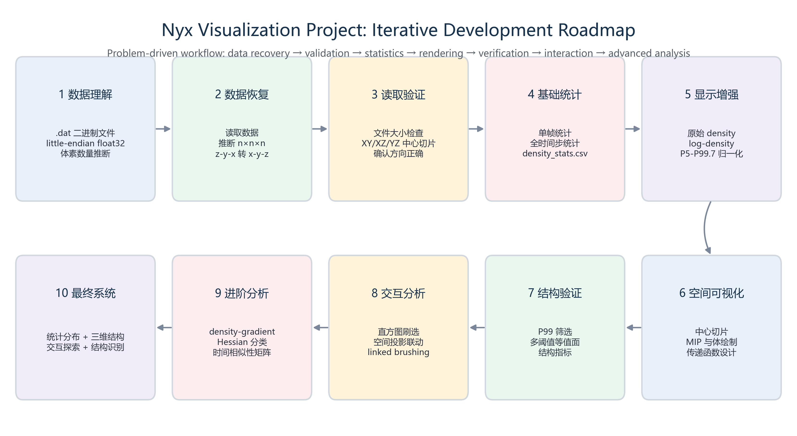

图 1 展示了从无到有的实验迭代路线。图中每个阶段都对应一个明确问题：数据理解阶段解决文件格式问题，数据恢复阶段解决三维体构建问题，读取验证阶段解决轴顺序可信性问题，基础统计阶段解决时序量化问题，显示增强阶段解决动态范围问题，空间可视化阶段解决三维结构表达问题，结构验证阶段解决视觉结果的统计依据问题，交互分析阶段解决静态图无法探索的问题，最终系统阶段将这些模块整合为完整作品。该图的局限在于它是流程图，不展示具体数值结果，因此需要后续结果图进一步验证。

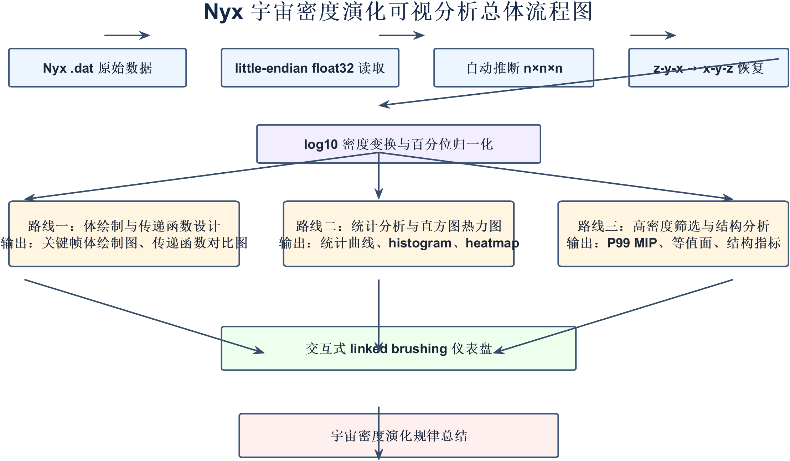

图 2 从系统角度展示了数据流和分析路线。原始 `.dat` 数据经过二进制读取、轴顺序恢复、log-density 变换和百分位归一化后，分别进入统计分析、体绘制、高密度筛选、结构指标和交互展示模块。该图说明本实验的最终目标不是单一图表，而是由多个互相验证的可视化模块构成的分析系统。

# 2 数据处理

本章介绍数据处理过程，包括实验环境、数据格式、二进制读取、轴顺序恢复、完整性检查、log-density 变换以及 Web 展示数据预处理。该部分是后续所有图像和交互系统的基础。

## 2.1 实验环境

表 2：实验环境说明

| 项目 | 说明 |
|---|---|
| 操作系统 | Windows |
| 主要工具 | MATLAB、Python、HTML、CSS、JavaScript |
| MATLAB 用途 | 数据读取、统计分析、体绘制、P99 筛选、结果图生成 |
| Python 用途 | Web 数据预处理、JSON/bin 生成、报告辅助图生成 |
| Web 用途 | 最终交互展示、时间播放、直方图刷选、空间联动 |
| 可选工具 | Image Processing Toolbox、FFmpeg |

实验采用 MATLAB 和 Python 结合的方式。MATLAB 更适合矩阵运算、体数据处理和结果图生成；Python 更适合生成 Web 端所需的轻量 JSON 和二进制数据；HTML/CSS/JavaScript 则用于构建最终展示页面。不同工具承担不同任务，有助于提高项目完整性。

## 2.2 数据格式分析

`.dat` 文件不是图像文件，也不是 CSV 表格，而是连续 float32 数值。对于 little-endian float32，每个数值占 4 字节，因此可以通过文件大小推断体素数量：

```text
体素数量 = 文件字节数 / 4
```

若体素数量满足：

```text
体素数量 = n^3
```

则可以恢复为 n×n×n 三维体数据。例如 8,388,608 字节文件包含 2,097,152 个 float32 数值，对应 128×128×128 网格。该推断过程避免手动写死分辨率，也能在文件损坏或尺寸异常时及时发现问题。

## 2.3 二进制数据读取

MATLAB 读取核心如下：

```matlab
fid = fopen(filename, 'r', 'ieee-le');
data = fread(fid, inf, 'single=>single');
fclose(fid);
```

第一行指定 little-endian 读取方式，第二行将文件内容读为 single 类型数组，第三行关闭文件句柄。该代码看似简单，但它决定了后续所有数值是否正确。如果字节序或数据类型设置错误，密度值会出现异常，从而影响统计曲线、体绘制和 P99 阈值。

## 2.4 网格尺寸推断与轴顺序恢复

读取一维数组后，程序先调用 `infer_grid_size` 推断 n，再执行：

```matlab
Vzyx = reshape(data, [n, n, n]);
V = permute(Vzyx, [3, 2, 1]);
```

其中 `Vzyx` 对应原始 z-y-x 存储顺序，`permute` 后得到 x-y-z 三维体。该转换是 Nyx 数据处理中的关键步骤。如果直接把一维数组 reshape 为 MATLAB 默认理解的 x-y-z 顺序，空间方向会被错误解释，中心切片和投影结果都会失真。

## 2.5 数据完整性检查

数据完整性检查包括三部分。第一，读取优先时间步 `0000.dat`，输出尺寸、最小值、最大值、均值、标准差、NaN 数量、Inf 数量和负值数量。第二，提取 XY、XZ、YZ 三个中心切片，并使用 `log10(max(V,eps))` 显示。第三，检查所有 `.dat` 文件大小是否一致。

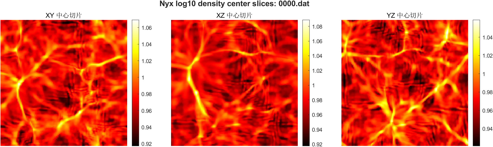

图 3 展示三个方向中心切片。图中纹理连续，没有明显条纹和错位，说明读取和轴顺序恢复基本正确。中心切片图的作用是验证单帧空间结构是否合理，但它只能观察体数据中间截面，不能代表完整三维结构。

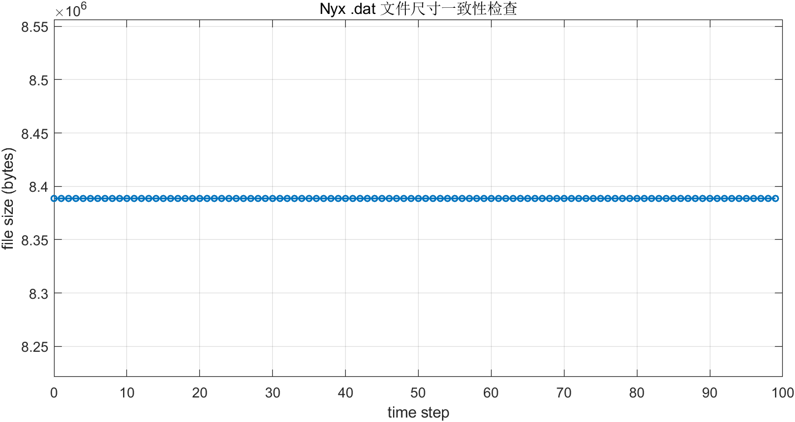

图 4 展示所有时间步文件大小检查结果。若文件大小一致，说明所有时间步具有相同网格规模，全时间步统计和动画播放才具有可比性。该图与中心切片图相互补充：中心切片验证空间方向，文件大小检查验证时序数据规模一致。局限是文件大小一致不能完全保证数值内容正确，因此仍需统计量检查。

## 2.6 log-density 变换与百分位归一化

原始 density 往往具有较宽动态范围，直接线性显示会导致低密度和中密度结构不明显。因此实验使用：

```matlab
logV = log10(max(V, eps));
```

该变换压缩高密度值，使空洞、丝状结构和节点能够同时出现在可视范围中。显示时进一步使用 P5 到 P99.7 百分位裁剪并归一化到 [0,1]，减少极端值对颜色映射的影响。需要注意的是，显示使用 log-density，但 P99 高密度阈值仍基于原始 density 计算，以保持统计含义。

## 2.7 Web 展示数据预处理

浏览器不适合直接加载 100 帧完整 128×128×128 float32 体数据。若一次性加载，内存占用和渲染开销都会影响展示流畅性。因此实验编写 `preprocess_for_web.py`，将每个时间步转换为 64×64×64 的 normalized log-density Float32Array，并保存为 `vol_0000.bin` 至 `vol_0099.bin`。

同时，脚本生成 `metadata.json`、`density_stats.json`、`histograms.json`、`time_density_heatmap.json` 和 `time_similarity_stage.json`。这样 Web 前端可以按需 fetch 当前时间步体数据，而不是一次性加载全部体。该策略体现了科学可视化作品中“离线计算 + 在线交互”的工程思路。

# 3 关键技术描述

本章按照实验报告中常见的“为什么要做—怎么做—核心代码—局限性”方式，说明本项目使用的关键可视化技术。

## 3.1 Nyx 三维密度场解析方法

方法目的在于将不可直接查看的 `.dat` 文件恢复为空间上有意义的三维密度体。方法思路是先按 little-endian float32 读取一维数组，再根据体素总数推断立方体边长，最后按照 z-y-x 原始顺序恢复并转置为 x-y-z。

实现步骤包括：读取文件、检查体素数量、推断 n、reshape、permute 和类型转换。该方法与赛题任务直接相关，因为所有后续体绘制、统计分析和交互展示都建立在正确三维体数据之上。局限在于它假设每个时间步为规则立方体网格，如果遇到非立方体数据或包含文件头的数据，需要额外解析元信息。

## 3.2 宇宙密度时序统计分析方法

方法目的在于从全时间步角度量化密度演化。方法思路是将每个三维体展平为一维体素数组，计算全局统计量和高百分位指标。mean 表示总体平均水平，std 表示波动程度，P95/P99 表示高密度尾部，P99/mean 和 P99-P01 表示分布不均匀程度。

该方法的实现流程为：遍历所有 `.dat` 文件，读取体数据，计算原始 density 统计量，再计算 log-density 的均值、标准差、偏度和峰度。统计结果保存为 CSV 和 MAT 文件，方便 MATLAB、Python 和 Web 端复用。局限在于统计曲线不包含空间位置信息，因此只能说明数值分布变化，不能说明高密度体素位于哪里。

## 3.3 对数密度直方图与 time-density heatmap

对数密度直方图用于观察单个时间步的密度分布形态，time-density heatmap 则用于观察全时间步分布演化。实现时对每个时间步计算 `log10(max(density,eps))`，使用统一 bins 统计 probability histogram，再将所有时间步直方图堆叠成二维热力图。

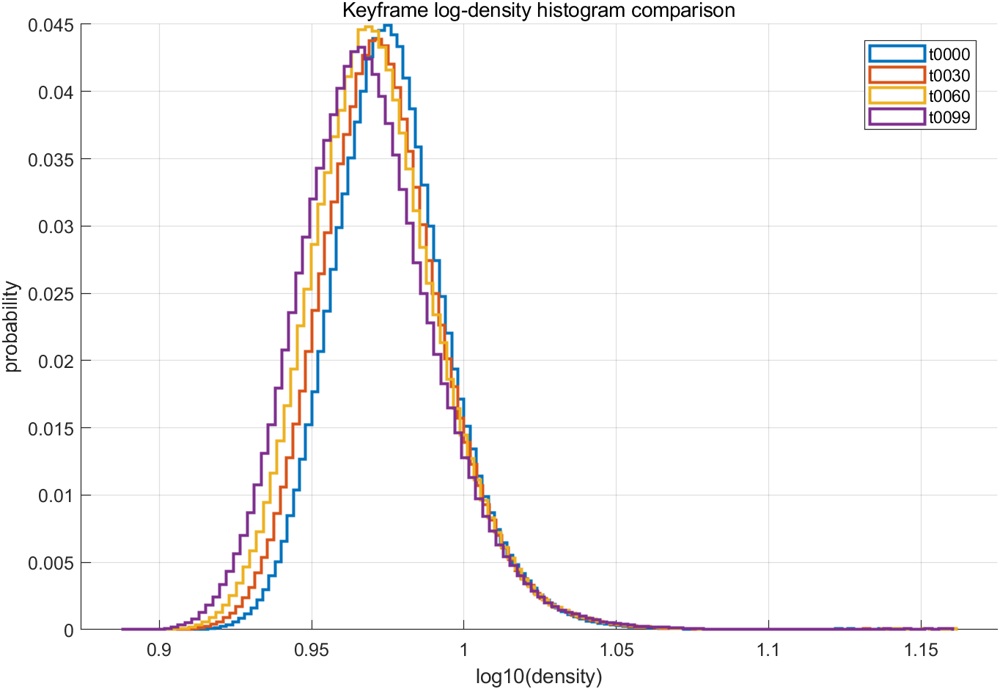

图 5 展示代表时间步 log-density 直方图。图中可以观察分布中心、宽度和右尾变化。若后期右尾更长，说明极高密度体素更明显。该图与统计曲线中的 P99 和 max density 相互印证，但它不包含空间位置。

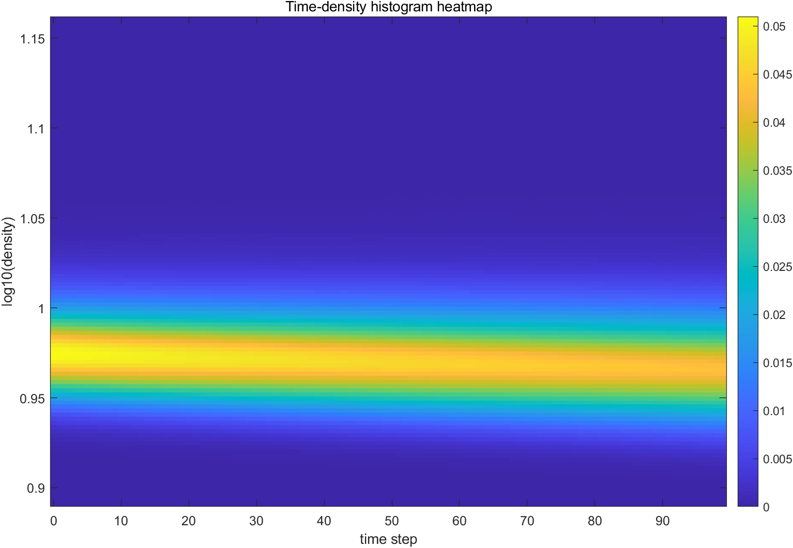

图 6 展示 time-density heatmap。横轴为时间步，纵轴为 log-density，颜色表示 probability。该图能够整体展示密度分布随时间扩散和右尾增强的趋势。其局限是不能直接说明具体空间结构，需要与 MIP、体绘制和 P99 mask 联合分析。

## 3.4 自定义体绘制与 alpha compositing

方法目的在于突破二维切片的局限，展示三维密度场整体空间形态。alpha compositing 的基本思想是将体数据沿观察方向逐层投影，每一层根据颜色和透明度与前面累积结果合成。简化公式为：

```text
C_out = C_in + (1 - A_in) * alpha * C_layer
A_out = A_in + (1 - A_in) * alpha
```

本项目沿 z 方向从后向前合成归一化 log-density。低密度体素透明度较低，中密度体素半透明，高密度体素更不透明。颜色由自定义 LUT 控制，从深蓝/黑过渡到紫色、橙色、黄色和白色。该方法满足赛题中体数据渲染要求。局限是当前体绘制主要为固定方向合成，不具备完整交互式三维旋转。

## 3.5 传递函数设计

传递函数决定密度值如何映射到颜色和透明度。Balanced 模式用于整体观察，兼顾中密度和高密度结构；Void 模式增强低密度区域，便于观察空洞；Filament 模式增强中密度连续结构，突出宇宙网丝状结构；Node 模式增强高密度尾部，突出节点和团块。

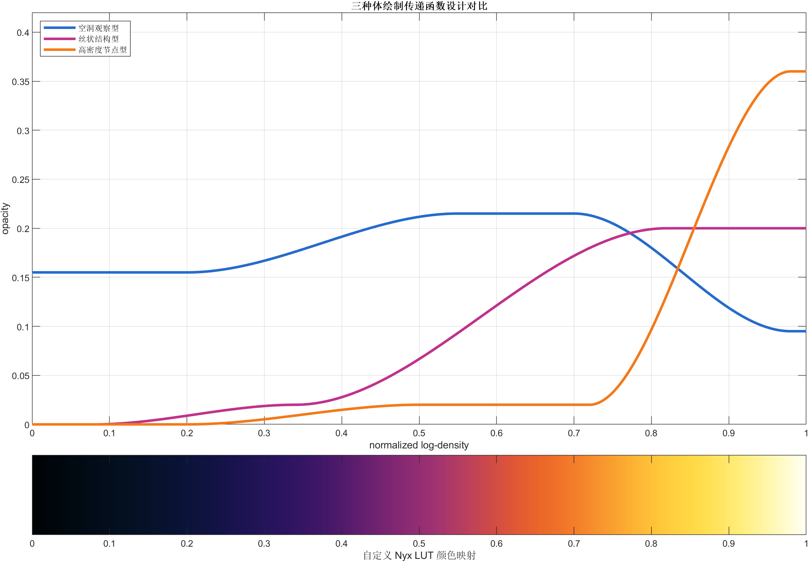

图 7 展示不同传递函数曲线。可以看到不同曲线在 normalized log-density 上关注的区间不同。该图说明传递函数不是图像美化，而是服务于不同科学观察任务。局限是传递函数具有主观性，因此需要统计阈值和结构指标验证体绘制观察。

## 3.6 梯度增强与类光照处理

梯度幅值反映密度场局部变化程度。实验计算：

```text
gradMag = sqrt(gx^2 + gy^2 + gz^2)
```

密度变化剧烈的位置往往对应空洞边界、丝状结构边缘或团块边界，因此用 gradMag 增强 alpha 或亮度可以提高结构边界可见性。本实验称其为“类光照”，因为它并不模拟真实物理光源和表面反射，只是在视觉上增强边界层次。

## 3.7 P99 top 1% 高密度筛选

P99 表示 99% 体素密度低于该阈值，P99 到 P100 区间即密度最高的 1% 体素。本实验使用原始 density 计算 P99 阈值，而不是使用 log-density 阈值，因为原始 density 更能保持统计意义。显示时则使用 log-density MIP，以便在图像中更清楚地显示空间结构。

P99 筛选的核心逻辑为：

```matlab
threshold = prctile(double(V(:)), 99);
mask = V >= threshold;
selectedRatio = nnz(mask) / numel(mask);
```

该方法能够直接回答赛题中“筛选占比 1% 的极高密度区间”的要求。局限是 P99 是经验阈值，不同阈值会得到不同范围，因此本实验进一步使用 P90/P95/P99 多阈值等值面比较层级结构。

## 3.8 多阈值等值面与结构层级分析

多阈值等值面用于观察密度结构从外层到核心的层级关系。P90 通常覆盖较大范围中高密度区域，P95 更集中，P99 只保留最致密节点。通过不同颜色和透明度绘制嵌套等值面，可以观察丝状外壳向高密度核心收缩的过程。

该方法适合展示空间层级，但对阈值敏感；同时等值面可能遮挡内部结构，因此需要与 MIP、体绘制和交互刷选结合分析。

## 3.9 linked brushing 相空间交互刷选

linked brushing 的目标是将统计分布与空间结构联系起来。仪表盘左侧显示当前时间步 log-density histogram，用户通过百分位滑条或 brush 选择密度区间；右侧空间投影视图根据所选区间实时生成 mask 并显示对应投影。

这种设计使用户可以从统计直方图中选择“右尾高密度体素”，再在空间中查看它们是否位于节点和丝状交汇处。它解决了静态图固定阈值、固定时间步的问题。局限是 MATLAB GUI 依赖本地环境，不够适合答辩现场快速展示，因此项目进一步开发 Web 系统。

## 3.10 Web 最终交互式展示系统

Web 系统的目的在于将离线分析成果转化为可演示作品。它使用 Python 预处理体数据，生成 JSON 和降采样 bin 文件；前端使用原生 HTML/CSS/JavaScript 和 Canvas 实现空间视图、直方图、heatmap 和统计曲线联动。

核心交互包括 time slider 切换时间步、Play/Pause 播放演化、density percentile slider 选择密度区间、Top 1% 高密度一键筛选、histogram brush 与空间视图联动、X/Y/Z 投影方向切换，以及 MIP/Mask/Masked MIP/Slice 模式切换。该系统提升了最终作品的展示性和可传播性。

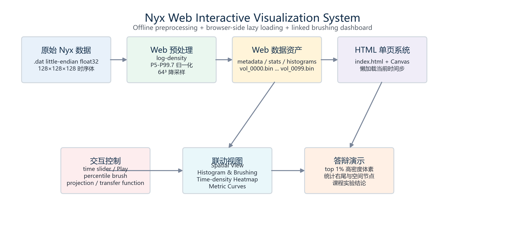

图 8 展示 Web 系统的数据流。原始 Nyx 数据经预处理后形成轻量体数据和统计 JSON，浏览器端按需加载当前时间步。该图说明 Web 作品并不直接加载完整原始体数据，而是采用离线计算和在线交互结合的策略。局限是 Web 端使用降采样数据和简化 Canvas 渲染，适合展示但不替代高精度离线分析。

## 3.11 density-gradient 二维相空间

density-gradient 相空间将密度值和梯度幅值组合为二维特征空间。低密度低梯度区域可对应空洞背景，中密度高梯度区域可对应丝状结构边界，高密度高梯度区域可对应节点边界，高密度低梯度区域可能对应致密核心。该方法扩展了一维 density brush。

## 3.12 Hessian 宇宙网结构分类

Hessian 特征值描述局部密度场的二阶变化。课程实验中采用简化规则：统计三个特征值中小于负阈值的数量，粗略区分 Void、Sheet、Filament 和 Node。该方法能够补充体绘制和 P99 筛选，但分类结果依赖平滑尺度和阈值，不作为正式宇宙学分类结论。

## 3.13 时间步相似性矩阵与阶段划分

时间步相似性矩阵将每个时间步 log-density histogram 作为概率向量，计算余弦相似度。若矩阵沿对角线出现块状结构，说明演化过程可粗略划分阶段。该方法有助于解释为什么选择 t=0000、0030、0060、0099 作为代表帧。

# 4 可视化结果与分析

本章集中展示实验结果，并按照“图像展示内容—观察现象—说明意义—与其他结果相互印证—局限性”的逻辑进行分析。

## 4.1 数据读取检查结果

图 3 和图 4 已在数据处理章节展示。中心切片图说明读取出的三维体在三个方向上具有连续纹理，文件大小检查图说明所有时间步具有相同体素规模。两者共同支撑后续全时间步分析。如果中心切片出现明显条纹，则可能是轴顺序错误；如果文件大小不一致，则需要跳过异常时间步或单独处理。

## 4.2 密度时序统计结果

图 5、图 6 和图 9 共同展示密度时序统计结果。

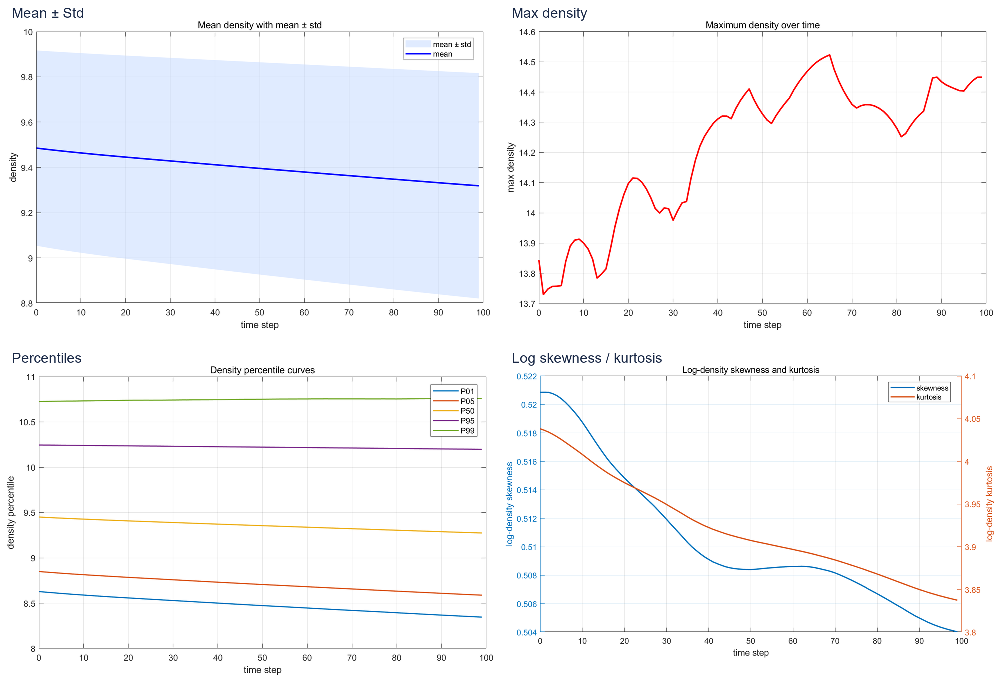

图 9 展示多类统计指标随时间变化。mean density 可能变化不明显，因为全局平均会掩盖局部高密度增长；相比之下，std、P99、P99/mean 和 P99-P01 更能反映密度场不均匀性增强。该图与图 6 的 heatmap 相互印证：heatmap 显示分布逐渐扩散，统计曲线则提供量化证据。局限是统计曲线仍不显示空间位置，因此需要体绘制和 P99 投影进一步解释。

## 4.3 体绘制关键帧结果

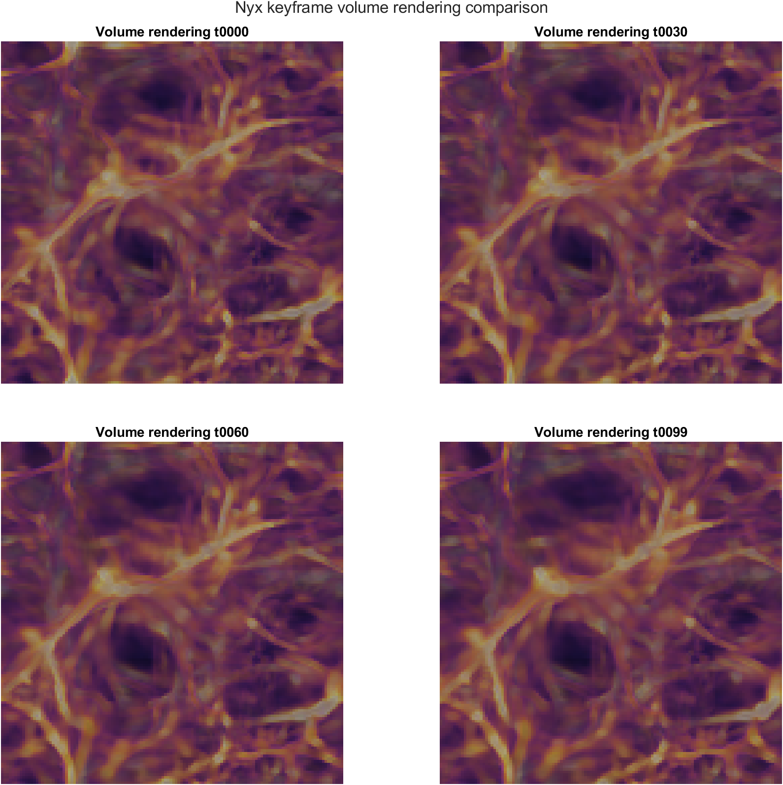

图 10 展示 t=0000、0030、0060、0099 四个代表时间步的体绘制结果。早期 t=0000 中密度结构较均匀，高密度节点不明显；t=0030 开始出现局部聚集；t=0060 中丝状结构更加连续；t=0099 中高密度节点和网络状结构更突出。从可视化角度看，这体现了密度场从相对平滑到结构增强的过程。

该图与统计曲线中的 std 和 P99 增强相互印证：体绘制显示空间结构增强，统计曲线说明数值分布波动增强。局限是体绘制受传递函数影响较大，因此不能单独作为高密度结构的统计证据。

## 4.4 传递函数对比结果

图 7 展示传递函数设计。Balanced 模式适合总体观察，Void 模式突出低密度空洞，Filament 模式突出中密度连续结构，Node 模式突出高密度节点。不同传递函数揭示不同密度层级，也说明同一体数据可以根据分析任务产生不同视觉重点。因此，报告中的体绘制结果必须结合 P99 筛选和统计曲线解释，避免把传递函数造成的视觉强调误认为唯一科学结论。

## 4.5 P99 高密度筛选结果

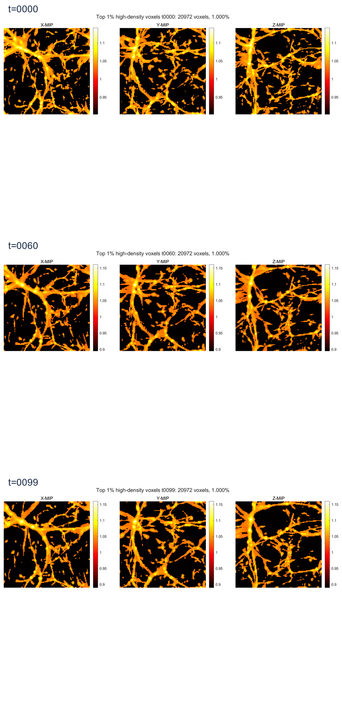

图 11 展示 P99 top 1% 高密度体素的空间投影。图中高密度体素不是均匀散布在全空间，而是集中于若干亮点和连续结构交汇处。该现象说明直方图右侧高密度尾部具有空间结构含义，可以对应宇宙网中的节点或团块区域。

该图与图 5 的直方图右尾、图 10 的体绘制节点增强相互印证：统计分布上出现右尾，空间投影中出现节点集中，体绘制中出现高亮团块。其局限是 MIP 会丢失深度信息，不同深度的结构可能重叠到同一二维位置，因此需要等值面或交互视图进一步辅助。

## 4.6 多阈值等值面结果

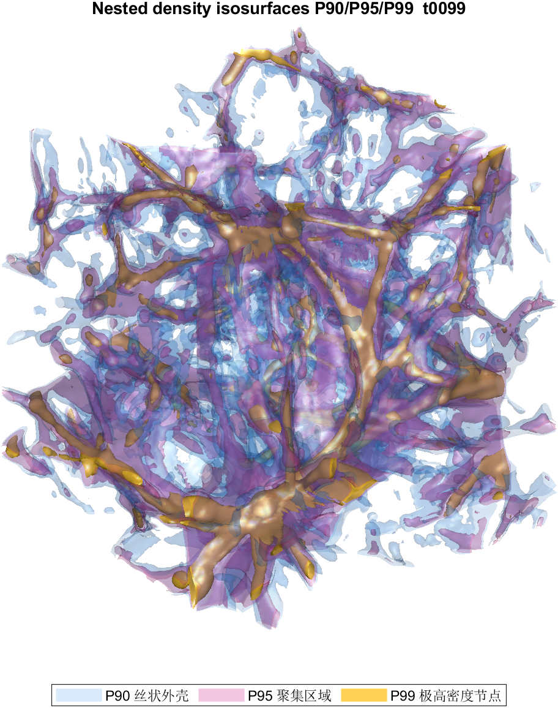

图 12 展示 P90、P95、P99 多阈值等值面。P90 范围较大，表现为中高密度丝状外壳；P95 更集中，显示高密度聚集区域；P99 只保留极高密度节点。该层级关系说明密度结构并非单一阈值下突然出现，而是从较大尺度的丝状区域逐渐收缩到致密核心。

该图与 P99 MIP 相互补充：MIP 便于观察投影分布，等值面便于观察三维层级。局限在于等值面结果对阈值敏感，P90、P95、P99 的选择会影响视觉范围，因此不能脱离统计指标单独解释。

## 4.7 linked brushing 交互分析结果

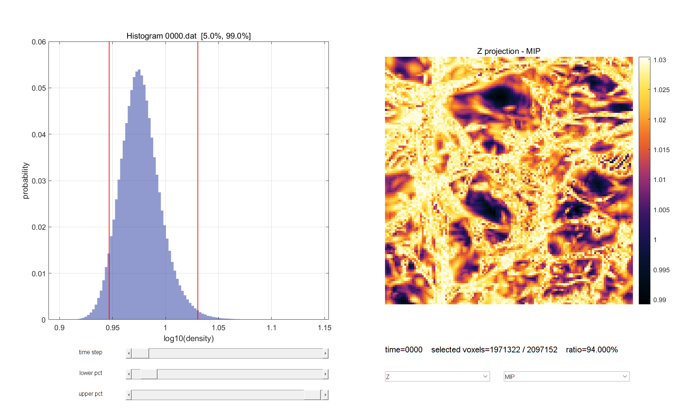

图 13 展示 linked brushing 仪表盘。左侧直方图表达当前时间步 log-density 分布，右侧空间视图显示所选密度区间对应的投影。用户调整密度百分位区间时，直方图高亮范围和空间投影同步变化。该图展示了从统计区间到空间位置的交互式查询过程。

当选择 99%-100% 区间时，右侧视图会显示 top 1% 高密度体素，用于验证高密度尾部是否集中在空间节点区域。该交互结果是对静态 P99 图的扩展。局限是 MATLAB GUI 依赖本地环境，且界面传播性不如浏览器页面，因此后续加入 Web 展示系统。

## 4.8 Web 交互展示结果

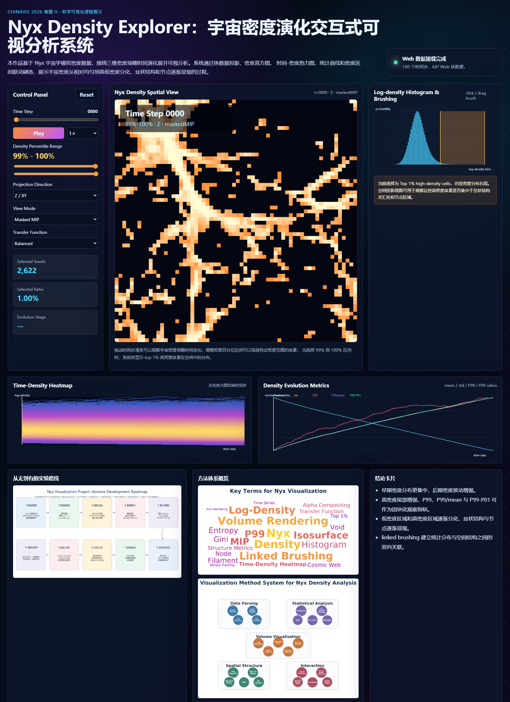

图 14 展示最终 Web 作品在浏览器中运行后的实际界面。页面左侧为控制面板，中间为空间视图，右侧为 histogram brush，底部为 time-density heatmap 和统计曲线。与 MATLAB dashboard 相比，Web 页面更适合答辩现场演示，因为用户只需启动本地服务器即可在浏览器中播放时间演化和刷选密度区间。

该图体现了最终作品从“实验结果图”到“交互式可视化系统”的转变。用户可以点击 Play 展示演化过程，也可以直接选择 99%-100% 区间观察 top 1% 高密度体素。该截图虽然能够展示页面布局和默认交互状态，但仍然是某一时刻的静态记录；真实交互效果需要在浏览器中运行 `index.html` 才能完整体验。

## 4.9 进阶可视分析结果

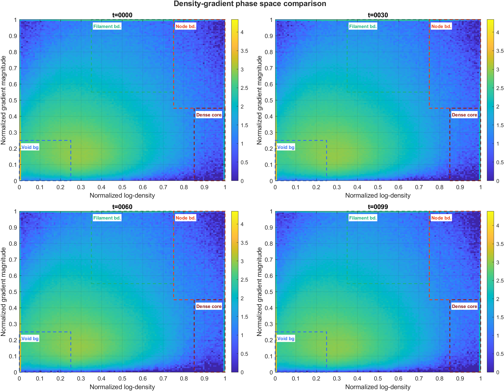

图 15 展示 density-gradient 二维相空间。高梯度区域通常对应结构边界，高密度低梯度区域可能对应致密核心。相比单变量密度直方图，该图能区分“密度高但变化平缓”和“密度变化剧烈的边界”两类结构。其局限是相空间本身不显示空间位置，因此需要结合 MIP 选择图。

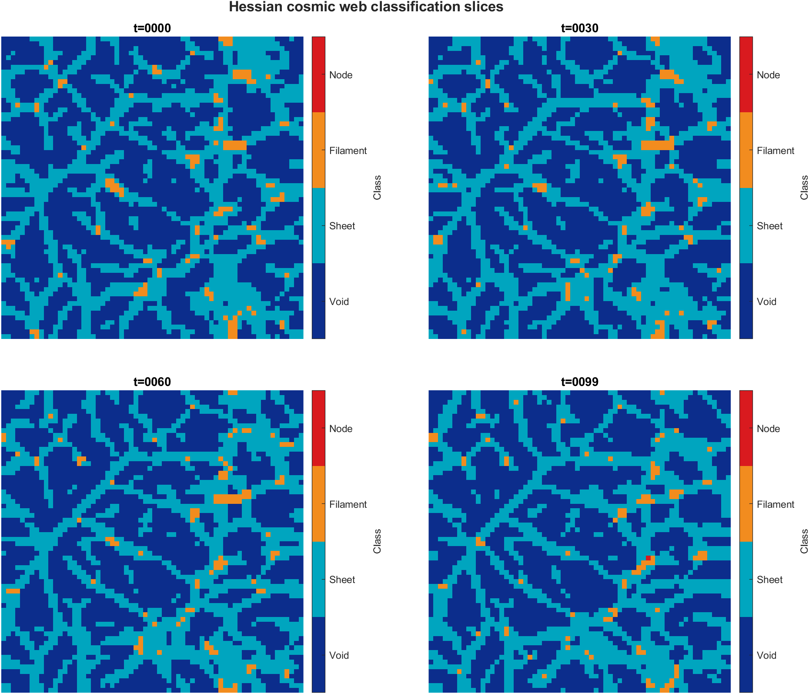

图 16 展示 Hessian 分类切片。不同颜色表示 Void、Sheet、Filament 和 Node 等类别。该结果从局部二阶结构角度补充了体绘制观察，使“宇宙网结构”不只停留在视觉描述上。局限是分类依赖平滑尺度和阈值，因此报告中只将其作为课程实验层面的结构识别近似。

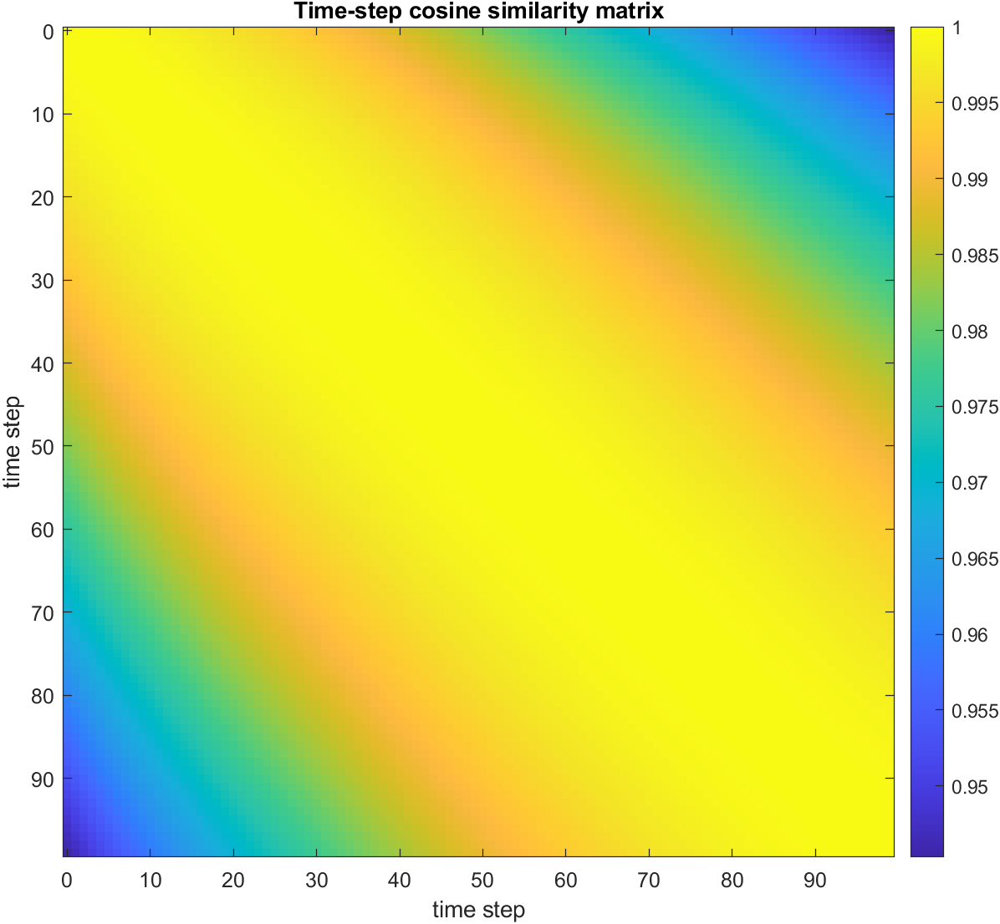

图 17 展示时间步相似性矩阵。矩阵对角线附近相似度较高，说明相邻时间步分布连续；远离对角线后相似度降低，说明早期和后期密度分布差异更大。该图为代表时间步选择和阶段划分提供数据依据。局限是它基于直方图分布，不包含完整空间对应关系。

## 4.10 综合规律分析

综合所有结果可以发现，Nyx 密度场在课程实验可视化层面呈现出从集中到分化的趋势。直方图和 heatmap 表明分布逐渐扩散，统计曲线显示 std、P99 和 P99-P01 等指标更能反映密度波动增强，体绘制显示空间中丝状结构和节点逐渐明显，P99 mask 则把高密度尾部映射回空间节点。

这些结果之间形成相互印证关系：统计图回答“数值分布如何变化”，体绘制回答“三维结构如何变化”，P99 筛选回答“高密度尾部在哪里”，linked brushing 和 Web 展示回答“用户如何交互验证这种对应关系”。因此，本项目体现了科学可视化中多视图联动和多方法验证的重要性。

# 5 实验过程与问题解决

本章总结实验从无到有的开发过程，并列出实验中遇到的主要问题及解决方案。

## 5.1 从无到有的实验迭代路线

实验最初面对的是无法直接查看的 `.dat` 文件，因此第一步不是绘图，而是恢复数据结构。完成 little-endian float32 读取后，实验通过中心切片判断轴顺序是否正确。随后，单帧观察被扩展到全时间步统计，形成 density_stats、histogram 和 heatmap。

在统计分析之后，实验发现原始 density 动态范围过大，因此加入 log-density 和百分位归一化。然后，二维切片空间信息不足的问题推动项目加入 MIP 和体绘制。体绘制展示了三维结构，但结果会受到传递函数影响，因此进一步引入 P99 高密度筛选、等值面和结构指标进行验证。

当静态图无法支持自由探索时，实验加入 linked brushing 仪表盘；当 MATLAB GUI 不便于答辩展示时，又进一步开发 Web 单页系统。最后，为了增强结构解释能力，加入 density-gradient 相空间、Hessian 分类和时间步相似性矩阵。整个过程体现了“发现不足—增加方法—验证结果”的迭代路线。

## 5.2 实验过程中遇到的问题与解决方法

表 3：实验过程中遇到的问题与解决方法

| 遇到的问题 | 产生原因 | 解决方法 | 对应模块 |
|---|---|---|---|
| `.dat` 文件无法直接查看 | 原始数据为二进制体数据 | little-endian float32 读取 | `read_nyx_dat.m` |
| 轴顺序不确定 | 原始数据按 z-y-x 顺序存储 | reshape 后 permute，并用中心切片验证 | `step1_check_data.m` |
| 原始 density 动态范围大 | 高密度值压缩中低密度结构 | log-density + 百分位归一化 | `normalize_percentile.m` |
| 切片无法展示三维结构 | 体数据具有空间深度 | MIP 和 alpha compositing 体绘制 | `step4_volume_render_keyframes.m` |
| 体绘制缺少统计依据 | 传递函数会影响视觉效果 | P99 mask、统计曲线、结构指标 | `step5`、`step6` |
| 静态图无法交互探索 | 固定时间步和固定阈值 | linked brushing 仪表盘 | `step7_interactive_dashboard.m` |
| MATLAB GUI 不便于答辩 | 依赖 MATLAB 环境 | HTML Web 展示系统 | `Nyx_Web_Visualization/` |
| 浏览器加载体数据过慢 | 原始 100 帧体数据体量大 | Python 预处理、降采样、懒加载 | `preprocess_for_web.py` |

## 5.3 方法改进路线总结

本项目的方法改进路线可以概括为三个层次。第一层是数据层，重点解决 Nyx 数据能否正确读出的问题。由于 `.dat` 文件没有直观结构，必须先理解二进制格式、字节序、体素数量和轴顺序。中心切片和文件大小检查是这一层的主要验证手段。

第二层是分析层，重点解决“读出后如何理解”的问题。全时间步统计、log-density histogram 和 time-density heatmap 描述数值分布变化；体绘制、MIP 和等值面描述空间结构；P99 mask 和结构指标则把统计尾部与空间节点联系起来。这一层强调多视图互相印证，而不是依赖单一图像。

第三层是交互展示层，重点解决“如何探索和展示”的问题。linked brushing 使用户可以从直方图选择密度区间并查看空间位置，Web 系统则将这一交互过程移植到浏览器中，使答辩现场可以直接展示时间播放、Top 1% 高密度筛选和空间联动。通过这三层迭代，项目从基础数据读取逐渐发展为完整的科学可视化作品。

# 6 结论与展望

## 6.1 主要结论

本实验完成了从 Nyx 二进制体数据读取到 HTML 交互展示的完整流程。针对密度信息变化，实验使用 log-density、体绘制、time-density heatmap、统计曲线和 Web 时间播放进行展示。针对宇宙密度演化特征，实验观察到早期密度分布相对集中，后期密度波动增强，高密度尾部拉长，低密度空洞和高密度节点逐渐分化，丝状结构和团块化特征增强。

针对高密度尾部是否具有空间意义，实验通过 P99 top 1% mask、MIP 和多阈值等值面发现，高密度体素集中在丝状结构交汇处和节点区域，说明直方图右尾与宇宙网致密结构存在对应关系。针对相空间刷选作用，linked brushing 和 Web histogram brush 实现了从统计区间到空间位置的实时联动。

## 6.2 可视化技术应用价值

本项目体现了不同可视化技术在科学体数据分析中的分工。统计图负责描述数值分布，体绘制负责展示三维结构，MIP 和等值面负责空间定位，交互刷选负责探索验证，Web 系统负责最终展示和传播。这些技术组合使用，比单一图表更适合解释 Nyx 这种高维时序体数据。

## 6.3 当前系统局限

当前体绘制主要沿固定方向合成，缺少真正自由三维旋转；Web 端使用降采样体数据和 Canvas 简化渲染，不能替代原始分辨率分析；Hessian 分类依赖平滑尺度和阈值；时间步相似性矩阵基于 histogram，不包含完整空间对应关系；项目仅分析 density 单变量，尚未结合 velocity、temperature 等变量。

## 6.4 后续扩展方向

后续可以引入 WebGL 或 Three.js 实现可旋转体绘制；加入二维传递函数，使用户同时刷选 density 和 gradient；扩展多变量数据分析；使用更稳健的拓扑方法或多尺度 Hessian 方法分析宇宙网结构。若用于更正式科学研究，还需要结合物理背景、模拟参数和专业验证方法。

# 7 附录：核心代码

## Code Listing 1：Nyx 二进制读取

对应模块：`read_nyx_dat.m` / `infer_grid_size.m`。代码作用是读取 little-endian float32 数据并恢复三维体。输入为 `.dat` 文件路径，输出为 `single` 三维数组 `V`。

```matlab
fid = fopen(filename, 'r', 'ieee-le');
data = fread(fid, inf, 'single=>single');
fclose(fid);
n = infer_grid_size(numel(data));
Vzyx = reshape(data, [n, n, n]);
V = permute(Vzyx, [3, 2, 1]);
```

## Code Listing 2：log-density 与百分位归一化

对应模块：`normalize_percentile.m`。代码作用是压缩动态范围并将显示值归一化到 [0,1]。输入为三维密度体，输出为归一化显示体。

```matlab
logV = log10(max(V, eps('single')));
Vn = normalize_percentile(logV, 5, 99.7);
```

## Code Listing 3：体绘制 alpha compositing

对应模块：`volume_render_alpha_composite.m`。代码作用是沿 z 方向逐层合成体数据。输入为归一化体数据，输出为 RGB 图像。

```matlab
for z = nz:-1:1
    layer = Vn(:,:,z);
    rgbLayer = ind2rgb(gray2ind(layer, 256), lut);
    alpha = alphaFunc(layer);
    img = img + (1 - accAlpha) .* alpha .* rgbLayer;
    accAlpha = accAlpha + (1 - accAlpha) .* alpha;
end
```

## Code Listing 4：P99 高密度筛选

对应模块：`step5_high_density_selection.m`。代码作用是提取 top 1% 高密度体素。输入为原始 density，输出为 mask 和被选比例。

```matlab
threshold = prctile(double(V(:)), 99);
mask = V >= threshold;
selectedRatio = nnz(mask) / numel(mask);
```

## Code Listing 5：linked brushing 关键逻辑

对应模块：`step7_interactive_dashboard.m`。代码作用是根据百分位区间生成 mask 并更新投影。

```matlab
lowT = prctile(logV(:), lowerPct);
highT = prctile(logV(:), upperPct);
mask = logV >= lowT & logV <= highT;
projection = max(logV .* single(mask), [], 3);
imagesc(axProjection, projection);
```

## Code Listing 6：Web 数据预处理

对应模块：`preprocess_for_web.py`。代码作用是将原始体数据转换为浏览器可加载的降采样 bin 文件。

```python
density = read_nyx_dat(path)
log_v = np.log10(np.maximum(density, EPS)).astype(np.float32)
norm_v, low, high = normalize_percentile(log_v, 5, 99.7)
small = downsample_volume(norm_v, target_size)
small.astype("<f4", copy=False).tofile(volume_dir / f"vol_{t:04d}.bin")
```

## Code Listing 7：Web 体数据懒加载

对应模块：`Nyx_Web_Visualization/web/app.js`。代码作用是在浏览器端按时间步加载体数据并缓存。输入为时间步编号，输出为 Float32Array。

```javascript
async function loadVolume(timeIndex) {
  if (state.volumeCache.has(timeIndex)) return state.volumeCache.get(timeIndex);
  const step = state.metadata.steps[timeIndex];
  const res = await fetch(DATA_BASE + step.volume_file);
  const volume = new Float32Array(await res.arrayBuffer());
  state.volumeCache.set(timeIndex, volume);
  return volume;
}
```
